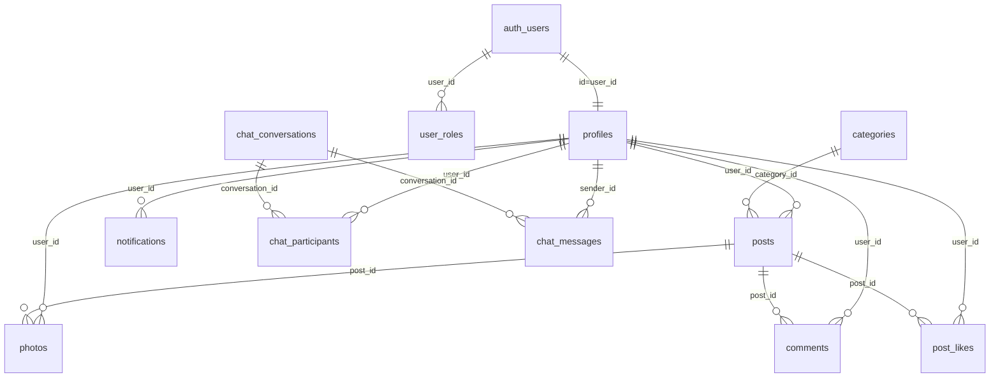

# Aquashares

Aquashares е многостранична (MPA) социална платформа за акваристика.
Потребителите могат да се регистрират, да влизат в профил, да публикуват обяви/теми, да качват снимки, да коментират, да харесват, да използват чат и да управляват профил.

## Основни технологии

- Frontend: HTML, CSS, JavaScript (ES Modules), Bootstrap 5
- Build tooling: Vite, Node.js, npm
- Backend: Supabase (Postgres, Auth, Storage, Realtime)
- Клиентска библиотека: `@supabase/supabase-js`

## Архитектура

Проектът следва feature-based модулна структура:

- Service layer: комуникация със Supabase (CRUD, auth, storage)
- UI layer: DOM, събития, rendering
- Shared utils: локализация, потвърждения, категории, помощни функции

Приложението е **multi-page app** (не SPA) и зарежда page-specific логика по страници.

## Структура на проекта

```text
.
├─ index.html
├─ login.html
├─ register.html
├─ post-create.html
├─ post-detail.html
├─ profile.html
├─ admin.html
├─ chat.html
├─ giveaway.html
├─ exchange.html
├─ wanted.html
├─ src/
│  ├─ main.css
│  └─ js/
│     ├─ main.js
│     ├─ auth/
│     ├─ posts/
│     ├─ comments/
│     ├─ profile/
│     ├─ admin/
│     ├─ chat/
│     ├─ notifications/
│     ├─ reactions/
│     ├─ nav/
│     ├─ services/
│     └─ utils/
├─ public/
├─ scripts/
└─ supabase/
   └─ migrations/
```

## База данни (Supabase/Postgres)

### Основни таблици

- `profiles`
- `user_roles`
- `categories`
- `posts`
- `photos`
- `comments`
- `post_likes`
- `notifications`
- `chat_conversations`
- `chat_participants`
- `chat_messages`
- `admin_notifications`

### ER диаграма



## Сигурност

- Supabase Auth (email/password)
- Route guards за ограничени страници
- Role-based достъп за admin
- RLS политики в базата за профили, постове, коментари, снимки и социални функции
- Storage правила за достъп в bucket-и

## Setup (Local Development)

### 1) Изисквания

- Node.js 18+
- npm
- Supabase проект

### 2) Инсталация

```bash
npm install
```

### 3) Environment променливи

Създай `.env` файл в root директорията:

```env
VITE_SUPABASE_URL=YOUR_SUPABASE_PROJECT_URL
VITE_SUPABASE_ANON_KEY=YOUR_SUPABASE_ANON_KEY
```

### 4) Стартиране

```bash
npm run dev
```

### 5) Build

```bash
npm run build
npm run preview
```

## Скриптове

```bash
npm run dev
npm run build
npm run preview
npm run check:max-lines
npm run seed:sample
npm run seed:reset
```

## Миграции и Supabase workflow

Всички schema промени се правят само чрез SQL migration файлове в `supabase/migrations/`.

Препоръчителен workflow:

1. Създай нов migration файл с timestamp в името.
2. Добави DDL/политики/индекси в migration-а.
3. Приложи migration-а към свързания Supabase проект.
4. Верифицирай таблици, RLS и runtime поведение.
5. Commit на кода + migration файла.

Пример с Supabase CLI (ако е настроен локално):

```bash
supabase db push
```

## Demo акаунт

- Email: `demo@aquashares.com`
- Password: `demo123`

## Live deployment (Netlify)

- Production URL: https://aquashares-jimmy-dvg.netlify.app
- Платформа: Netlify
- Последна верификация: 2026-03-03
- Smoke test: основните страници (`/`, `/index.html`, `/login.html`, `/register.html`, `/post-create.html`, `/profile.html`, `/admin.html`, `/chat.html`, `/giveaway.html`, `/exchange.html`, `/wanted.html`) връщат HTTP 200

## Production / Deployment checklist

- [ ] Валиден `VITE_SUPABASE_URL`
- [ ] Валиден `VITE_SUPABASE_ANON_KEY`
- [ ] Всички migrations приложени
- [ ] RLS политики активни
- [ ] `npm run build` минава успешно
- [ ] Основните user/admin потоци са smoke-tested
- [ ] Няма не-локализирани user-facing низове

## QA бележка (pre-release)

Последният pre-release QA pass включва:

- Console + Network одит
- Session/Auth проверка
- Performance trace по ключови страници
- Функционален smoke test на критичните потоци
- Рефактор на зареждане по страници, локализация и CLS стабилизация на admin

## Бъдещо развитие

Архитектурата е подготвена за разширения като:

- Marketplace модули
- Badges/репутация
- Разширени известия и inbox функционалности
- Допълнителни chat сценарии
